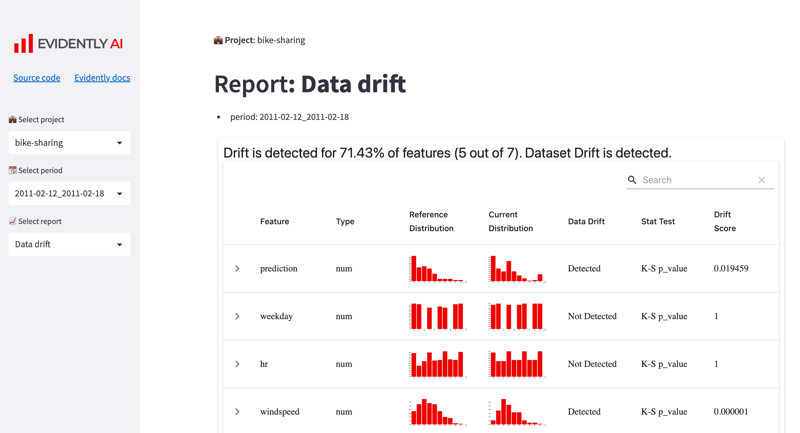

# ML Monitoring Dashboard with Evidently and Streamlit 📊🐍

This project demonstrates how to create a **Machine Learning (ML) Monitoring Dashboard** using **Evidently** and **Streamlit**. Evidently is a powerful tool for analyzing and monitoring data and model metrics, while Streamlit provides an intuitive interface for building interactive web applications. Together, they enable you to visualize and track the performance of your ML models in real-time.

By the end of this tutorial, you will have a fully functional ML monitoring dashboard that provides insights into your model's performance and data quality. 🚀

---

## Project Overview 📖

This example showcases how to:
1. **Set up a Streamlit dashboard** for monitoring ML models.
2. **Generate monitoring reports** using Evidently.
3. **Visualize data and model metrics** in an interactive and user-friendly interface.

The dashboard is designed to help you track key metrics, detect data drift, and ensure the reliability of your ML models in production.

---

## Preview 🖼️



---

## Prerequisites 📋

Before we begin, ensure you have the following installed on your system:

1. **Python** (version >= `3.9.12` recommended).
2. **Git**: To clone the repository.
3. **Virtual Environment**: To manage dependencies.

---

## Installation 🛠️

### Step 1: Clone the Repository

Clone the Evidently repository to your local machine:
```bash
git clone git@github.com:evidentlyai/evidently.git
cd evidently/examples/integrations/streamlit-dashboard

Step 2: Create a Virtual Environment

Create a virtual environment named .venv and activate it:

```bash
python3 -m venv .venv
source .venv/bin/activate
```

Note: Ensure you are using Python >= 3.9.12. Streamlit version 1.19.0 is incompatible with Python 3.9.7.

Step 3: Install Dependencies

Install the required Python libraries:

```bash
pip install -r requirements.txt
```
Step 4: Set Up Jupyter Notebook

Install the Jupyter kernel and extensions:

```bash
python -m ipykernel install --user --name=evidently
jupyter contrib nbextension install --user
```

## Launch the Monitoring Dashboard 🚀

Step 1: Navigate to the Streamlit App Directory

Change to the streamlit-app directory:

```bash
cd streamlit-app
```
Step 2: Run the Streamlit App

Launch the Streamlit application:

```bash
streamlit run app.py
```

This command starts a local Streamlit server and opens the Monitoring Dashboard in your default web browser.

## Generate Monitoring Reports with Evidently 📊

Step 1: Navigate to the Bike Sharing Project

Change to the bike-sharing project directory:

```bash
cd projects/bike-sharing
```
Step 2: Run Jupyter Notebook

Start Jupyter Notebook:

```bash
jupyter notebook
```

Step 3: Generate Reports

1. Open the notebook bicycle_demand_monitoring.ipynb.
2. Run all cells to generate predictions and create Evidently reports.
Note: All Evidently reports (.html files) are saved in the reports/ directory within each project.

## Documentation 📚

For more information, refer to the official documentation:

[Evidently Documentation](https://docs.evidentlyai.com/introduction)

[Streamlit Documentation](https://docs.streamlit.io/get-started)

## Key Features of the Dashboard 🌟

Data Drift Detection: Identify changes in data distribution over time.
Model Performance Monitoring: Track key metrics such as accuracy, precision, and recall.
Interactive Visualizations: Explore data and model metrics through interactive charts and graphs.
Customizable Reports: Generate and save reports for further analysis.

## Example Use Case: Bike Sharing Demand Prediction 🚴‍♂️

The provided example focuses on monitoring the performance of a bike-sharing demand prediction model. The dashboard allows you to:

* Visualize historical and real-time demand data.
* Detect anomalies or drifts in the data.
* Monitor the model's predictive performance.

## Conclusion 🎉

Congratulations! 🎉 You’ve successfully set up an ML Monitoring Dashboard using Evidently and Streamlit. This powerful combination enables you to monitor your ML models effectively, ensuring their reliability and performance in production environments.


Keep exploring and customizing the dashboard to suit your specific use cases. 🚀📊

Happy monitoring! 💻✨
